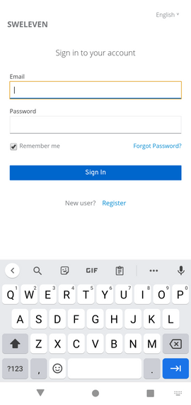

## Requisiti

L'applicazione mobile permette ai dipendenti di effettuare e gestire le prenotazioni per le postazioni aziendali. Permette inoltre ai dipendenti dell'azienda di pulizie la segnalazione dell'avvenuta pulizia di una stanza o di una postazione.

Per poter usufruire delle funzionalità dell'app è necessario avere a disposizione uno smartphone con:

1. sistema operativo Android (v9.0+);
2. lettore NFC integrato;
3. connettività internet.

## Installazione

La procedura di installazione dell'applicazione è unica sia per i dipendenti interni che per gli igienizzatori.
Per una corretta installazione dell'applicativo mobile, l'utente dovrà seguire pedissequamente i seguenti passi:

1. scaricare il file .zip da [questo indirizzo](https://gitlab.com/sweleven/android-app/-/jobs/artifacts/master/download?job=build-apk);
2. estrarre il file scaricato;
3. _opzionale_ verificare la validità del file app.apk scaricato tramite SHA1;
4. installare sul proprio smartphone il file app.apk;
5. approvare l'utilizzo dell'applicazione anche se proveniente da uno sviluppatore non identificato.

Una volta completati tutti i passi sopra-citati, si avrà installato con successo l'applicazione nel proprio dispositivo.

## Funzionalita' generali

### Registrazione

Per **registrarsi** presso il sistema è necessario che prima l'_amministratore_ abbia precedentemente creato una nuova utenza, inserendo l'indirizzo email del nuovo _utente_ ed assegnandovi un ruolo. 

Una volta creato il nuovo _account_, verrà inviato all'indirizzo email corrispondente registrato un link attraverso il quale, da parte dell'_utente_, sarà necessario **completare la procedura di registrazione** inserendo nell'apposita finestra il proprio nome, cognome, una nuova password personale e la conferma della suddetta.  

Una volta inseriti tutti i dati richiesti, la procedura di creazione di un nuovo utente è ultimata e si potrà accedere a tutte le funzionalità dell'applicazione.

### Login

L'accesso alle funzionalità dell'_applicazione mobile_ è possibile tramite apposita pagina di **login**.  
Alla prima apertura dell'applicazione apparirà in automatico la schermata di accesso. Per effettuare il login nell'applicativo, basterà inserire negli appositi campi il proprio indirizzo email e la propria password, indicati nel corso della procedura di registrazione.  

Una volta compilati i campi richiesti, basterà premere sul pulsante "**Sign In**" per completare la procedura di accesso.

> Qualora l'utente non si ricordi, non sia più in possesso o voglia modificare la propria password di accesso al sistema, avrà la possiblità di **re-impostarla**, come spiegato nelle apposite sezioni.

### Recupero password

Qualora l'utente abbia perso la propria password personale di accesso all'applicativo, sarà possibile re-impostarla nella schermata di accesso dell'applicazione, selezionando la voce **"Forgot password"**.  

Tramite questa funzionalità, si viene re-indirizzati ad una pagina in cui sarà necessario inserire il proprio indirizzo email al quale, se presente nel sistema (quindi correttamente registrato), verrà inviato un nuovo **link** in cui sarà possibile **creare una nuova password** per l'accesso all'applicativo.  

forgot password</em>" class="border-0" width="100%">

forgot password</em>" class="border-0" width="100%">

> Vincolo obbligatorio per il recupero della password è inserirne una nuova che rispetti i vincoli di lunghezza e complessità standard. In caso contrario, il sistema mostrerà a video un messaggio d'errore auto-esplicativo.  

Al termine della procedura, l'_utente_ potrà nuovamente **accedere** all'applicativo inserendo il suo indirizzo email e la nuova password **appena cambiata** nella schermata di login.

### Modifica password

Una volta effettuato il login all'interno dell'_applicazione mobile_ è possibile cambiare la propria password di accesso attraverso l'apposita funzionalità di **modifica** denotata dalla seguente icona: icona modifica password</em>" class="border-0" width="10%">  

Cliccando il pulsante in alto a sinistra di **"Modifica password"** e confermando l'operazione, si riceverà automaticamente una email contenente un link per il reset della password. 

dialog modifica password</em>" class="border-0" width="100%">

> Come già trattato nella sezione "**Recupero password**", la nuova password inserita dovrà soddisfare **tutti** i vincoli di lunghezza e complessità standard. 

Una volta terminata la procedura, l'utente potrà successivamente accedere all'applicativo tramite la **nuova password** appena modificata.

### Logout

Per **disconnettersi** dall'applicazione è sufficiente selezionare il pulsante di **"Logout"** posizionato a fianco al pulsante di modifica password, in alto a sinistra avente dalla seguente icona: pulsante logout</em>" class="border-0" width="10%">  

> Al successivo avvio dell'applicazione mobilr, all'utente verrà nuovamente chiesto l'inserimento delle credenziali di accesso.

dialog logout</em>" class="border-0" width="100%">

## Dipendente

### Prenotazione postazione

Tramite apposita funzionalità, l'utente può prenotare una specifica postazione, riservandosi una collocazione individuale all'interno del laboratorio informatico.
Per effetuare una **prenotazione**, l'utente deve premere sull'icona denotata dalla seguente immagine icona crea prenotazione</em>" class="border-0" width="10%"> e compilare, in ordine cronologico, i seguenti campi richiesti:

1. **selezione della data** in cui si intende effettuare la prenotazione:

   - La scelta della data è permessa tramite interazione dell'utente con un _widget_ a calendario. Per scegliere un giorno specifico, basterà cliccare sopra il numero del giorno desiderato.
      dialog seleziona data</em>" class="border-0" width="100%"> 

2. **selezione dell'orario di inizio** della prenotazione:
   - La scelta dell'orario di inizio della prenotazione è possibile tramite un _widget_ ad orologio dove, nella corona più esterna, vengono mostrati dei possibili orari di prenotazione. Per selezionare un orario basterà **trascinare il cursore** fino ad evidenziare l'ora desiderata. Una volta eseguita la medesima procedura anche per i minuti, per confermare la prenotazione della postazione nelle ore e minuti desiderate basterà confermare le informazioni inserite premendo il tasto di conferma recante la scritta "**ok**".
      dialog seleziona data</em>" class="border-0" width="100%"> 
3. **selezione della durata** della prenotazione:
   - Una volta selezionato l'orario di inizio di una prenotazione, sarà possibile scegliere la durata della prenotazione stessa, tramite selezione del numero di ore di cui si desidera usufruirne dalla lista delle ore a video.
      dialog seleziona data</em>" class="border-0" width="100%"> 
4. **scelta della stanza** in cui si intende effettuare la prenotazione:
   - La scelta della stanza è resa possibile mostrando all'utente una lista di stanze censite nel sistema ed attualmente disponibili. Per scelgere una stanza basterà cliccare sopra il riquadro avente il nome della stanza desiderato.
      dialog seleziona data</em>" class="border-0" width="100%"> 
5. **scelta della postazione** che si intende usufruire durante la prenotazione:
   - Per scegliere infine una postazione interna alla stanza precedentemente selezionata, l'utente dovrà cliccare sopra il nome della postazione desiderata.
      dialog seleziona data</em>" class="border-0" width="100%"> 

Una volta inseriti **tutti** i dati e premuto sul pulsante "**prenota**" in rosso, l'applicazione mostrerà una schermata di riepilogo per confermare i dati relativi alla prenotazione appena effettuata. Una volta che l'utente avrà confermato la prenotazione premendo sull'apposito tasto di conferma, il sistema restituirà un messaggio a video riguardante l'esito della prenotazione appena effettuata. Nel caso in cui l'utente si sia accorto di aver inserito dati errati, o non desideri più prenotare una postazione per la data o l'orario appena inseriti, potrà annullare la richiesta di prenotazione premendo sull'apposito tasto di cancellazione.

> In caso di errori nei campi dati la prenotazione non andrà a buon fine, e l'utente sarà avvisato, tramite una descrizione sottostante il campo dato errato, dell'errore di inserimento dello specifico campo dato.

> Per scelta progettuale, ogni postazione è usufruibile dalle ore 8:00 di mattina fino alle ore 20:00 di sera.

### Lista prenotazioni

Tramite questa funzionalità, l'utente può visualizzare uno **storico** delle sue prenotazioni effettuate.
Entrando nell'apposita sezione **Prenotazioni effettuate** dalla seguente icona icona prenotazioni effettuate</em>" class="border-0" width="10%">, comparirà a video la lista delle prenotazioni effettuate.
Per ogni prenotazione saranno mostrate a video le seguenti informazioni:

1. **id prenotazione**: è un numero univoco che serve al sistema per identificare ogni prenotazione;
2. **stanza**: è un numero univoco che serve al sistema per identificare ogni stanza;
3. **nome** della postazione prenotata: visualizzazione del nome identificativo della postazione prenotata;
4. **data e orario di inizio** della prenotazione: data e orario di inizio di prenotazione di una postazione;
5. **data e orario di fine** della prenotazione: data e orario di fine di prenotazione di una postazione;
6. **data e orario di cancellazione** della prenotazione: data e orario di cancellazione di una prenotazione.

schermata dettaglio prenotazione</em>" class="border-0" width="100%">

### Cancellazione prenotazione

## Cancellazione di una prenotazione

Nel caso in cui l'utente abbia inserito una prenotazione **errata**, o non desiderasse più usufruire della prenotazione effettuata, potrà semplicemente **eliminarla** tramite apposita funzionalità presente nel sistema.
Per cancellare una prenotazione, l'utente dovrà visualizzare i dettagli relativi alla prenotazione che desidera cancellare, e selezionare l'apposita funzionalità di **rimozione della prenotazione**.

dialog cancella prenotazione</em>" class="border-0" width="100%">

Una volta eliminata una prenotazione, il sistema confermerà l'avvenuta cancellazione della stessa, e le postazioni o stanze precedentemente prenotate in date ed orari precisi torneranno ad essere nuovamente fruibili agli utenti.

### Pulizia

## Marcatura di una postazione igienizzata

Una volta terminato l'utilizzo di una postazione prenotata, l'utente ha la possibilità di **marcare la postazione** utilizzata come **igienizzata**, quindi servibile ad un successivo utente.
Per marcare una postazione come igienizzata, basterà avviare l'apposita funzionalità dall'applicazione e scansionare il codice **tag RFID** associato alla postazione utilizzata.
Una volta scansionato il tag, il sistema registrerà che la postazione appena scansionata è stata **correttamente igienizzata**, e la renderà fruibile e prenotabile da un altro utente.

dialog pulizia postazione</em>" class="border-0" width="100%">

### Scansione presenza

## Scansione del tag RFID per segnalare la propria presenza

Per cominciare ad usurfruire di una postazione, è necessario prima che il dipendente **scansioni** un apposito **tag RFID** per informare l'applicazione dell'avvenuta **occupazione** della postazione.
Per effettuare l'operazione di scansione precedentemente descritta, il dipendente dovrà recarsi nell'apposita **sezione di scansione tag RFID** nell'applicazione, e avvicinare il telefono al tag.
Tramite scansione del tag RFID associato alla postazione scelta dal dipentente, il sistema registra con successo l'**avvenuta occupazione** della postazione da parte dell'utente.

dialog inizio uso postazione</em>" class="border-0" width="100%">

### Terminazione

## Scansione del tag RFID per segnalare il termine di utilizzo della postazione

Una volta che un dipendente ha **terminato l'utilizzo** di una postazione, per informare il sistema dell'avvenuto termine di utilizzo, bisognerà utilizzare l'apposita funzionalità di **scansione tag RFID** nell'applicazione.
Successivamente quando chiesto dall'applicazione, l'utente dovrà scansionare il **tag RFID** della postazione che si stava utilizzando.
Tramite scansione del tag RFID, il sistema registra con successo l'avvenuto termine di utilizzo della stessa, chiedendo all'utente se ha pulito o meno la postazione, e marcandone il nuovo stato.

dialog termine uso postazione</em>" class="border-0" width="100%">

## Igienizzazione

### Lista stanze

## Visualizzazione della lista delle stanze da igienizzare

Tramite questa funzionalità, l'_igienizzatore_ può visualizzare a video la **lista** delle stanze che necessitano di una **igienizzazione**. Per ogni stanza da igienizzare censita nel sistema, è mostrato a video il suo codice identificativo ed il nome. Per visualizzare l'elenco delle stanze da igienizzare, l'_igienizzatore_ dovrà selezionare l'apposita funzionalità "**Stanze usate**" dall'applicazione mobile. Una volta selezionata, appariranno a video l'elenco delle stanze da igienizzare, come riportato nella seguente schermata di esempio:

lista stanze usate</em>" class="border-0" width="100%">

### Marcatura

## Marcatura di una stanza come igienizzata tramite tag RFID

Per contrassegnare una stanza igienizzata, rendendo tutte le postazioni al suo interno **nuovamente servibili** dagli utenti, l'_igienizzatore_ dovrà marcare la stanza come igienizzata. Per igienizzare con successo una stanza, si dovrà scannerizzare il codice RFID identificativo della stanza selezionata. Successivamente alla scansione, tutte le postazioni interne alla stanza acquisiranno lo stato di igienizzate, e quindi servibili dagli utenti.
Per marcare una stanza come igienizzata, l'_igienizzatore_ selezionerà dalla lista delle stanze la stanza desiderata come da seguente immagine:

lista stanze usate</em>" class="border-0" width="100%">

Successivamente, è richiesto all'_igienizzatore_ di procedere con la **scansione** del **tag RFID** premendo sull'apposita icona situata a destra dei dettagli della stanza. La scansione del tag RFID può richiedere alcuni secondi. E' quindi necessario che l'igienizzatore **mantenga il dispositivo ad una distanza sufficiente** dal tag RFID per completarne la lettura.

lista stanze usate</em>" class="border-0" width="100%">

Al termine della scansione, l'_igienizzatore_ viene informato sullo stato della stessa e, in caso di esito positivo, verrà mostrato a video un messaggio di avvenuta igienizzazione, come nell'immagine sotto-riportata.

lista stanze usate</em>" class="border-0" width="100%">

Nel caso in cui l'_igienizzazione_ non si sia conclusa con un esito positivo, l'utente verrà informato tramite un messaggio a video auto-esplicativo, come rappresentato nella seguente immagine:

lista stanze usate</em>" class="border-0" width="100%">

> Al termine dell'igienizzazione della stanza selezionata, questa non apparirà più nella lista di stanze ancora da igienizzare, ma verrà spostata nella lista delle stanze igienizzate.

Per visualizzare a video la lista delle stanze già igienizzate con successo basterà premere sopra il pulsante recante la scritta "**Stanze igienizzate**".
In questa pagina, l'_igienizzatore_ vedrà un sommario a video di tutte le stanze già igienizzate con successo. Un esempio di questa schermata è riportato nell'immagine sottostante:

lista stanze usate</em>" class="border-0" width="100%">
