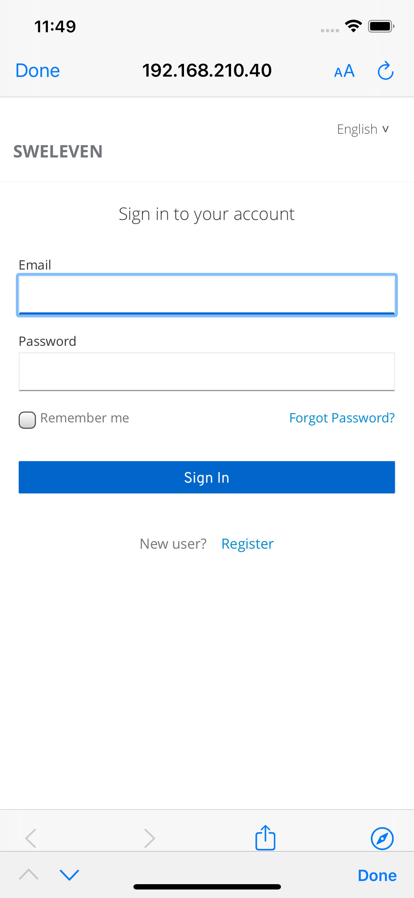

Le funzionalità fornite dall'applicazione Web sono disponibili solo dopo aver effettuato la procedura di login con le credenziali da *amministratore*.  
Per effettuare il login sarà sufficiente inserire le proprie credenziali (indirizzo email di registrazione e password personale) nei campi dati del form dedicato, che compare all'avvio del *portale* web.

